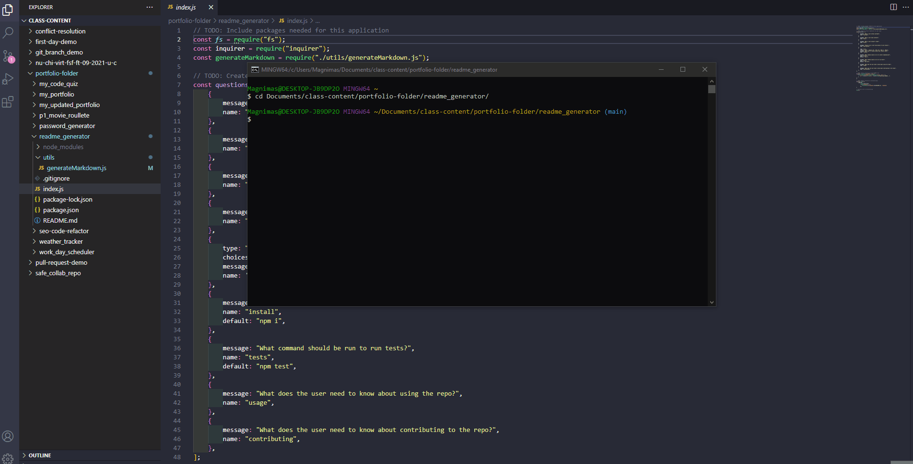
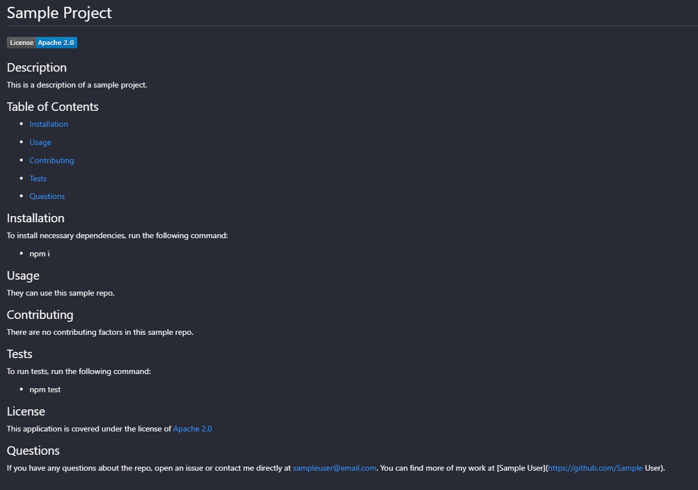

# Readme Generator

Building upon the foundation of a readme generator.

# Pseudo Code

* Create a command-line application that dynamically generates a professional README.md file from a user's input.
* Want a README generator that can quickly create a professional README for a new project.
* WHEN prompted for information about application repository a high-quality, professional README.md is generated with the Title, Description, Table of Contents, Installation, Usage, License, Contributing, Tests, and Questions
* WHEN project title is entered then it is displayed as the title of the README
* WHEN description, installation instructions, usage information, contribution guidelines, and test instructions are given, then the information is added to the sections of the README entitled Description, Installation, Usage, Contributing, and Tests
* WHEN a license is chosen for the application from a list of options provided, then a badge for the chosen license is added near the top of the README in addition to a notice in the section of the README entitled License that explains which license the application is covered under.
* WHEN a GitHub username is entered, then it is added to the section of the README entitled Questions, with a link to the GitHub profile
* WHEN an email address is entered, then it too is added to the section of the README entitled Questions, with instructions on how to reach that email with additional questions.
* WHEN the links in the Table of Contents are clicked, then you are taken to the corresponding section of the README.

# Demonstration

# Screenshot

# Github Profile

https://github.com/riveranelson99/readme_generator